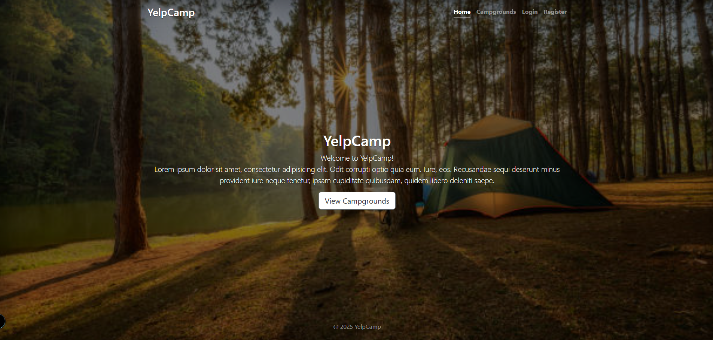
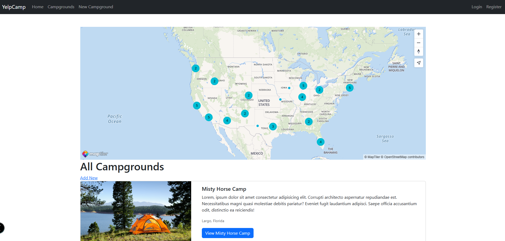

# 🏕️ YelpCamp

A full-stack web application where users can browse, create, edit, and review campgrounds. Inspired by Yelp and built with Node.js, Express, MongoDB, and EJS.

---

## 🚀 Features

- User authentication (Register/Login/Logout) with Passport.js
- Create, edit, delete campgrounds
- Upload images to Cloudinary
- Map display using MapTiler
- Flash messages for success/error
- Reviews for each campground
- MongoDB for data storage
- Responsive UI using Bootstrap 5
- Geolocation (longitude/latitude) for each campground
- PDF invoice (on order – optional feature)
- Form validation on frontend/backend
- Cluster map of all campgrounds

---

## 🛠️ Tech Stack

| Technology        | Description                                  |
|-------------------|----------------------------------------------|
| **Node.js**       | Backend JavaScript runtime                   |
| **Express.js**    | Web framework for Node.js                    |
| **MongoDB**       | NoSQL database                               |
| **Mongoose**      | ODM for MongoDB                              |
| **EJS**           | Template engine for dynamic HTML             |
| **Bootstrap 5**   | CSS framework for responsive UI              |
| **Passport.js**   | Authentication middleware                    |
| **Cloudinary**    | Image hosting and storage                    |
| **Multer**        | File upload middleware                       |
| **MapTiler SDK**  | Interactive maps display                     |
| **dotenv**        | Environment variable management              |

---

## 🖼️ Screenshots




📸 View more screenshots in the [`screenshots/`](./screenshots) folder.

---

## ⚙️ Installation

### 1. Clone the repo

```bash
git clone https://github.com/georgebetsios/YelpCamp.git
cd YelpCamp
npm install
Create .env file and add:
CLOUDINARY_CLOUD_NAME=your_name
CLOUDINARY_KEY=your_key
CLOUDINARY_SECRET=your_secret
DB_URL=mongodb://127.0.0.1:27017/yelp-camp
SECRET=your_session_secret

node seeds/index.js
npm run start

